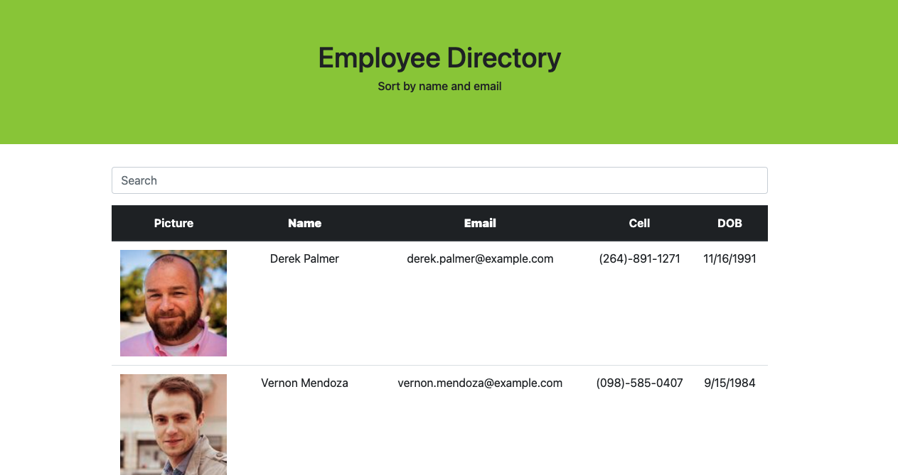
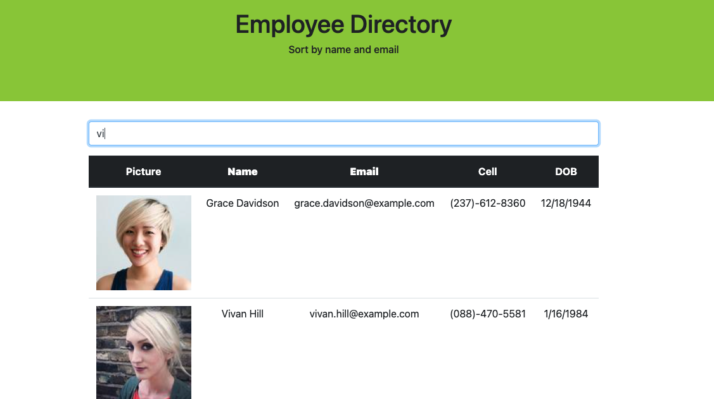
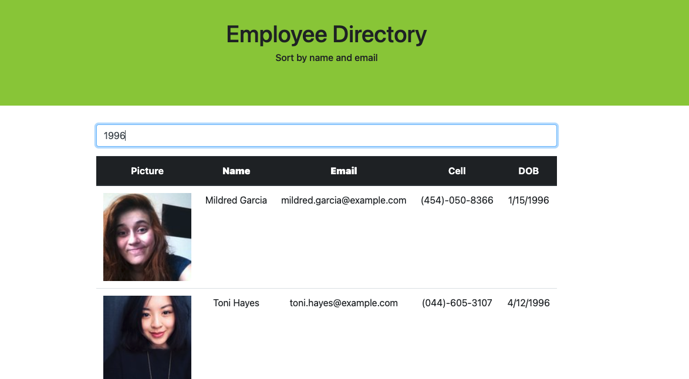
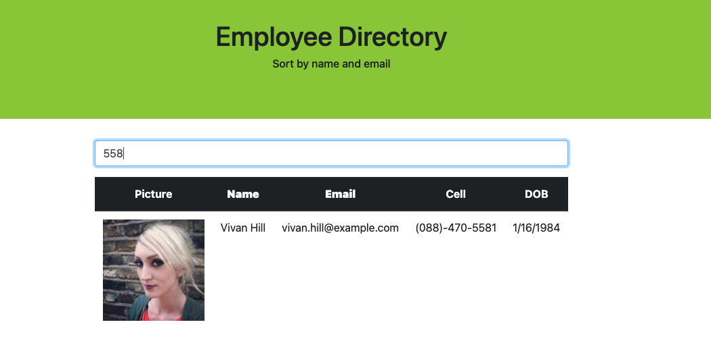
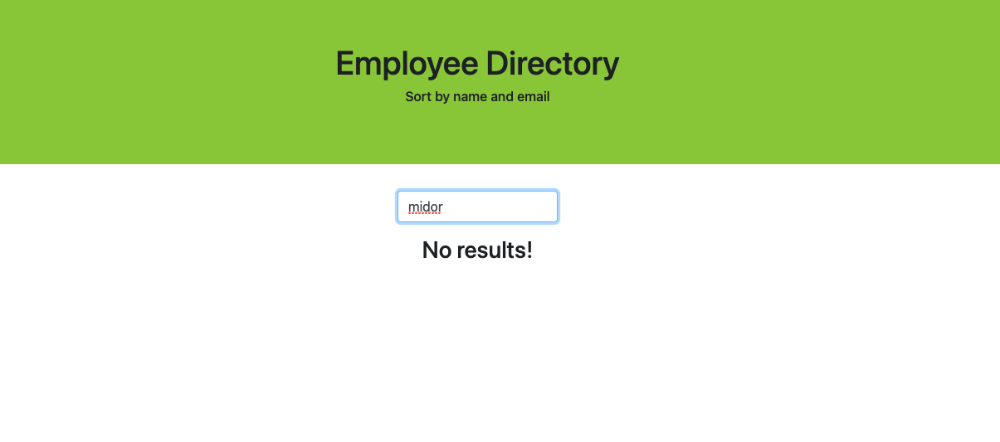

# 19_employee_directory

## Overview

For this assignment, you'll create a employee directory with React. This assignment will require you to break up your application's UI into components, manage component state, and respond to user events.

## User Story

- As a user, I want to be able to view my entire employee directory at once so that I have quick access to their information.
  

## Bussines Context

Manager or employee can view non-sensitive data about other employees.
They can filter employees by:

## Name:

## DOB:

## Cell phone number:

## If we do not have such an employee

## More

You can see more info in the [Create React App.](https://create-react-app.dev/docs/getting-started)
To learn React [React](https://reactjs.org/)

## Deployment

https://create-react-app.dev/docs/deployment/

## Tools

[Service Workers,](https://developers.google.com/web/fundamentals/primers/service-workers)
[Stylesheet,](https://getbootstrap.com/docs/4.0/getting-started/introduction/)
[FontAwesome](https://fontawesome.com/v4.7/icon/sort-desc)
and etc.

## Work
